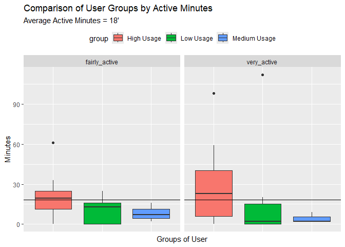
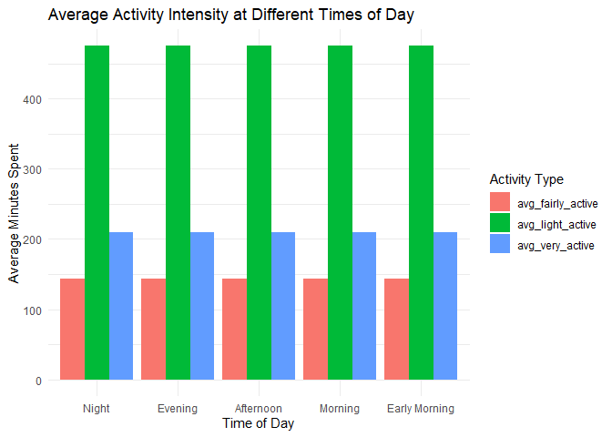

FitBit Tracker Data
================
Keyah Taneja
2024-05-30

# About the Company

Bellabeat is a high-tech manufacturer of health-focused products for
women. Bellabeat is a successful small company, but they have the
potential to become a larger player in the global smart device market.
Urška Sršen, cofounder and Chief Creative Officer of Bellabeat, believes
that analyzing smart device fitness data could help unlock new growth
opportunities for the company.

#### Services offered by Bellabeat

1.  Bellabeat app: The Bellabeat app provides users with health data
    related to their activity, sleep, stress, menstrual cycle, and
    mindfulness habits. This data can help users better understand their
    current habits and make healthy decisions. The Bellabeat app
    connects to their line of smart wellness products.
2.  Leaf: Bellabeat’s classic wellness tracker can be worn as a
    bracelet, necklace, or clip. The Leaf tracker connects to the
    Bellabeat app to track activity, sleep, and stress.
3.  Time: This wellness watch combines the timeless look of a classic
    timepiece with smart technology to track user activity, sleep, and
    stress. The Time watch connects to the Bellabeat app to provide you
    with insights into your daily wellness.
4.  Spring: This is a water bottle that tracks daily water intake using
    smart technology to ensure that you are appropriately hydrated
    throughout the day. The Spring bottle connects to the Bellabeat app
    to track your hydration levels.
5.  Bellabeat membership: Bellabeat also offers a subscription-based
    membership program for users. Membership gives users 24/7 access to
    fully personalized guidance on nutrition, activity, sleep, health
    and beauty, and mindfulness based on their lifestyle and goals.

**The dataset provided is not representative of all the services offered
by Bellabeat devices and is limited in its scope. However, it will help
us gain an understanding of features that promote active use of similar
devices and guide marketing and product designing strategies for
Bellabeat.**

These datasets were generated by respondents to a distributed survey via
Amazon Mechanical Turk between 03.12.2016-05.12.2016. Thirty eligible
Fitbit users consented to the submission of personal tracker data,
including minute-level output for physical activity, heart rate, and
sleep monitoring. Limitations such as the size of data sample and the
fact that not knowing key information such as participants’ demographic
characteristics, lifestyle, time location, weather indicators, activity
tracker usage , unfortunately, would limit the scope of analysis that
can be performed.

\# Questions for Analysis: 1. What are some trends in smart device
usage? 2. How could these trends apply to Bellabeat customers? 3. How
could these trends help influence Bellabeat marketing strategy?

## Business Task:

### Identify potential opportunities for growth and recommendations for the Bellabeat marketing strategy improvement based on trends in smart device usage.

This project will analyze FitBit Fitness Tracker Data available on
[kaggle](https://www.kaggle.com/datasets/arashnic/fitbit/data). Through
the analysis of this open source data, we can get insights into factors
influencing the usage of such fitness tracking devices which can help
our stakeholders design new devices or update existing devices
accordingly.

### Approach

Initially, I will do EDA to observe any trends, patterns and
associations between variables. Since we have dates for when the data
was collected, the number of days will account for higher or lower usage
of fitness devices.

The main focus will be on what features are used the most.

For the purpose of this analysis, I will be focusing on hourly data and
disregarding the minute level data.

#### Installing and Loading Packages

``` r
# install.packages("tidyverse")
# install.packages("dplyr")
# install.packages("ggplot2")
# install.packages("readr")
# install.packages("VennDiagram")
# install.packages("lubridate")
# install.packages("DataExplorer")
# install.packages("janitor")
# install.packages("tidyr")
# install.packages("gridExtra")
# install.packages("UpSetR")
# install.packages("ggridges")
# install.packages("plotly")
# install.packages("openair")
# install.packages("formattable")
# install.packages("plotrix")
# install.packages("viridis")
# install.packages("GGally")
# install.packages("RColorBrewer")
# install.packages("ggbeeswarm")
# install.packages("corrplot")
```

``` r
library(tidyverse)
```

    ## Warning: package 'ggplot2' was built under R version 4.4.2

    ## Warning: package 'tidyr' was built under R version 4.4.2

    ## Warning: package 'dplyr' was built under R version 4.4.2

    ## Warning: package 'lubridate' was built under R version 4.4.2

    ## ── Attaching core tidyverse packages ──────────────────────── tidyverse 2.0.0 ──
    ## ✔ dplyr     1.1.4     ✔ readr     2.1.5
    ## ✔ forcats   1.0.0     ✔ stringr   1.5.1
    ## ✔ ggplot2   3.5.1     ✔ tibble    3.2.1
    ## ✔ lubridate 1.9.4     ✔ tidyr     1.3.1
    ## ✔ purrr     1.0.2     
    ## ── Conflicts ────────────────────────────────────────── tidyverse_conflicts() ──
    ## ✖ dplyr::filter() masks stats::filter()
    ## ✖ dplyr::lag()    masks stats::lag()
    ## ℹ Use the conflicted package (<http://conflicted.r-lib.org/>) to force all conflicts to become errors

``` r
library(dplyr)
library(ggplot2)
library(readr)
library(VennDiagram)
```

    ## Loading required package: grid
    ## Loading required package: futile.logger

``` r
library(lubridate)

library(janitor)
```

    ## 
    ## Attaching package: 'janitor'
    ## 
    ## The following objects are masked from 'package:stats':
    ## 
    ##     chisq.test, fisher.test

``` r
library(tidyr)
library(gridExtra)
```

    ## Warning: package 'gridExtra' was built under R version 4.4.2

    ## 
    ## Attaching package: 'gridExtra'
    ## 
    ## The following object is masked from 'package:dplyr':
    ## 
    ##     combine

``` r
library(grid)
library(UpSetR)
library(ggridges)
library(openair)
library(plotly)
```

    ## Warning: package 'plotly' was built under R version 4.4.2

    ## 
    ## Attaching package: 'plotly'
    ## 
    ## The following object is masked from 'package:ggplot2':
    ## 
    ##     last_plot
    ## 
    ## The following object is masked from 'package:stats':
    ## 
    ##     filter
    ## 
    ## The following object is masked from 'package:graphics':
    ## 
    ##     layout

``` r
library(formattable)
```

    ## 
    ## Attaching package: 'formattable'
    ## 
    ## The following object is masked from 'package:plotly':
    ## 
    ##     style

``` r
library(viridis)
```

    ## Warning: package 'viridis' was built under R version 4.4.2

    ## Loading required package: viridisLite

``` r
library(plotrix)
library(GGally)
```

    ## Registered S3 method overwritten by 'GGally':
    ##   method from   
    ##   +.gg   ggplot2

``` r
library(RColorBrewer)
library(ggbeeswarm)
library(corrplot)
```

    ## Warning: package 'corrplot' was built under R version 4.4.2

    ## corrplot 0.95 loaded

## Reading data files

``` r
daily_activity <- read.csv("dailyActivity_merged.csv")
hourly_calories <- read.csv("hourlyCalories_merged.csv")
hourly_intensities <- read.csv("hourlyIntensities_merged.csv")
hourly_steps <- read.csv("hourlySteps_merged.csv")
sleep_day <- read.csv("sleepDay_merged.csv")
heart_rate <- read.csv("heartrate_seconds_merged.csv")
weightLog <- read.csv("weightLogInfo_merged.csv")

# looking at the first few rows of each dataset
head(daily_activity)
```

    ##           Id ActivityDate TotalSteps TotalDistance TrackerDistance
    ## 1 1503960366    4/12/2016      13162          8.50            8.50
    ## 2 1503960366    4/13/2016      10735          6.97            6.97
    ## 3 1503960366    4/14/2016      10460          6.74            6.74
    ## 4 1503960366    4/15/2016       9762          6.28            6.28
    ## 5 1503960366    4/16/2016      12669          8.16            8.16
    ## 6 1503960366    4/17/2016       9705          6.48            6.48
    ##   LoggedActivitiesDistance VeryActiveDistance ModeratelyActiveDistance
    ## 1                        0               1.88                     0.55
    ## 2                        0               1.57                     0.69
    ## 3                        0               2.44                     0.40
    ## 4                        0               2.14                     1.26
    ## 5                        0               2.71                     0.41
    ## 6                        0               3.19                     0.78
    ##   LightActiveDistance SedentaryActiveDistance VeryActiveMinutes
    ## 1                6.06                       0                25
    ## 2                4.71                       0                21
    ## 3                3.91                       0                30
    ## 4                2.83                       0                29
    ## 5                5.04                       0                36
    ## 6                2.51                       0                38
    ##   FairlyActiveMinutes LightlyActiveMinutes SedentaryMinutes Calories
    ## 1                  13                  328              728     1985
    ## 2                  19                  217              776     1797
    ## 3                  11                  181             1218     1776
    ## 4                  34                  209              726     1745
    ## 5                  10                  221              773     1863
    ## 6                  20                  164              539     1728

``` r
head(hourly_calories)
```

    ##           Id          ActivityHour Calories
    ## 1 1503960366 4/12/2016 12:00:00 AM       81
    ## 2 1503960366  4/12/2016 1:00:00 AM       61
    ## 3 1503960366  4/12/2016 2:00:00 AM       59
    ## 4 1503960366  4/12/2016 3:00:00 AM       47
    ## 5 1503960366  4/12/2016 4:00:00 AM       48
    ## 6 1503960366  4/12/2016 5:00:00 AM       48

``` r
head(hourly_intensities)
```

    ##           Id          ActivityHour TotalIntensity AverageIntensity
    ## 1 1503960366 4/12/2016 12:00:00 AM             20         0.333333
    ## 2 1503960366  4/12/2016 1:00:00 AM              8         0.133333
    ## 3 1503960366  4/12/2016 2:00:00 AM              7         0.116667
    ## 4 1503960366  4/12/2016 3:00:00 AM              0         0.000000
    ## 5 1503960366  4/12/2016 4:00:00 AM              0         0.000000
    ## 6 1503960366  4/12/2016 5:00:00 AM              0         0.000000

``` r
head(hourly_steps)
```

    ##           Id          ActivityHour StepTotal
    ## 1 1503960366 4/12/2016 12:00:00 AM       373
    ## 2 1503960366  4/12/2016 1:00:00 AM       160
    ## 3 1503960366  4/12/2016 2:00:00 AM       151
    ## 4 1503960366  4/12/2016 3:00:00 AM         0
    ## 5 1503960366  4/12/2016 4:00:00 AM         0
    ## 6 1503960366  4/12/2016 5:00:00 AM         0

``` r
head(sleep_day)
```

    ##           Id              SleepDay TotalSleepRecords TotalMinutesAsleep
    ## 1 1503960366 4/12/2016 12:00:00 AM                 1                327
    ## 2 1503960366 4/13/2016 12:00:00 AM                 2                384
    ## 3 1503960366 4/15/2016 12:00:00 AM                 1                412
    ## 4 1503960366 4/16/2016 12:00:00 AM                 2                340
    ## 5 1503960366 4/17/2016 12:00:00 AM                 1                700
    ## 6 1503960366 4/19/2016 12:00:00 AM                 1                304
    ##   TotalTimeInBed
    ## 1            346
    ## 2            407
    ## 3            442
    ## 4            367
    ## 5            712
    ## 6            320

``` r
head(heart_rate)
```

    ##           Id                 Time Value
    ## 1 2022484408 4/12/2016 7:21:00 AM    97
    ## 2 2022484408 4/12/2016 7:21:05 AM   102
    ## 3 2022484408 4/12/2016 7:21:10 AM   105
    ## 4 2022484408 4/12/2016 7:21:20 AM   103
    ## 5 2022484408 4/12/2016 7:21:25 AM   101
    ## 6 2022484408 4/12/2016 7:22:05 AM    95

``` r
head(weightLog)
```

    ##           Id                  Date WeightKg WeightPounds Fat   BMI
    ## 1 1503960366  5/2/2016 11:59:59 PM     52.6     115.9631  22 22.65
    ## 2 1503960366  5/3/2016 11:59:59 PM     52.6     115.9631  NA 22.65
    ## 3 1927972279  4/13/2016 1:08:52 AM    133.5     294.3171  NA 47.54
    ## 4 2873212765 4/21/2016 11:59:59 PM     56.7     125.0021  NA 21.45
    ## 5 2873212765 5/12/2016 11:59:59 PM     57.3     126.3249  NA 21.69
    ## 6 4319703577 4/17/2016 11:59:59 PM     72.4     159.6147  25 27.45
    ##   IsManualReport        LogId
    ## 1           True 1.462234e+12
    ## 2           True 1.462320e+12
    ## 3          False 1.460510e+12
    ## 4           True 1.461283e+12
    ## 5           True 1.463098e+12
    ## 6           True 1.460938e+12

In the analysis, the datasets provided by Bellabeat were structured such
that each record was associated with a unique identifier (ID), serving
as the primary key. This consistent use of IDs across all datasets
enabled seamless merging of data, ensuring that information from
different tables could be accurately linked. By using this primary key,
we combined the datasets to create a comprehensive dataset, facilitating
analysis across variables such as user activity, sleep patterns, and
device usage.

## Cleaning the Data

First, we will begin by cleaning and formatting the datasets.

``` r
# Checking if the data contains any missing values

sum(is.na(daily_activity))
```

    ## [1] 0

``` r
sum(is.na(hourly_calories))
```

    ## [1] 0

``` r
sum(is.na(hourly_intensities))
```

    ## [1] 0

``` r
sum(is.na(hourly_steps))
```

    ## [1] 0

``` r
sum(is.na(sleep_day))
```

    ## [1] 0

``` r
sum(is.na(heart_rate))
```

    ## [1] 0

``` r
sum(is.na(weightLog))
```

    ## [1] 65

As we can see there are 65 missing values in the weightLog dataset,
however, further analysis reveals we won’t be using this dataset,
therefore, these values are not replaced.

Starting by cleaning the column names

``` r
daily <- daily_activity %>%
  clean_names() %>%
  mutate(date = mdy(daily_activity$ActivityDate), day_week=weekdays(date)) %>%
  select(1,16,17,3,15,4,11:14)

head(daily)
```

    ##           id       date  day_week total_steps calories total_distance
    ## 1 1503960366 2016-04-12   Tuesday       13162     1985           8.50
    ## 2 1503960366 2016-04-13 Wednesday       10735     1797           6.97
    ## 3 1503960366 2016-04-14  Thursday       10460     1776           6.74
    ## 4 1503960366 2016-04-15    Friday        9762     1745           6.28
    ## 5 1503960366 2016-04-16  Saturday       12669     1863           8.16
    ## 6 1503960366 2016-04-17    Sunday        9705     1728           6.48
    ##   very_active_minutes fairly_active_minutes lightly_active_minutes
    ## 1                  25                    13                    328
    ## 2                  21                    19                    217
    ## 3                  30                    11                    181
    ## 4                  29                    34                    209
    ## 5                  36                    10                    221
    ## 6                  38                    20                    164
    ##   sedentary_minutes
    ## 1               728
    ## 2               776
    ## 3              1218
    ## 4               726
    ## 5               773
    ## 6               539

The primary key, ‘ID,’ served as a reference to combine the datasets. By
matching IDs across datasets, we created a unified dataset that included
comprehensive hourly activity data.

``` r
hourly_activity <- hourly_calories %>%
  left_join(hourly_intensities, by = c("Id","ActivityHour")) %>%
  left_join(hourly_steps, by= c("Id","ActivityHour")) %>%
  clean_names() %>%
  mutate(act_hour = mdy_hms(activity_hour), day_week=weekdays(act_hour)) %>%
  separate(act_hour, into=c("date", "time"), sep= " ") %>%
  mutate(date = ymd(date)) %>% #keeping date format same as daily activity 
  select(-average_intensity) %>% #removing since we have total intensity
  select (1,6,7,8,3:5)
```

    ## Warning: Expected 2 pieces. Missing pieces filled with `NA` in 934 rows [1, 25, 49, 73,
    ## 97, 121, 145, 169, 193, 217, 241, 265, 289, 313, 337, 361, 385, 409, 433, 457,
    ## ...].

``` r
head(hourly_activity)
```

    ##           id       date     time day_week calories total_intensity step_total
    ## 1 1503960366 2016-04-12     <NA>  Tuesday       81              20        373
    ## 2 1503960366 2016-04-12 01:00:00  Tuesday       61               8        160
    ## 3 1503960366 2016-04-12 02:00:00  Tuesday       59               7        151
    ## 4 1503960366 2016-04-12 03:00:00  Tuesday       47               0          0
    ## 5 1503960366 2016-04-12 04:00:00  Tuesday       48               0          0
    ## 6 1503960366 2016-04-12 05:00:00  Tuesday       48               0          0

Preparing the sleep day table

``` r
sleep <- sleep_day %>%
  clean_names() %>%
  separate(sleep_day, into= c("date","time"), sep=" ") %>%
  mutate(date = mdy(date), day_week = weekdays(date)) %>%
  select (-time) %>%
  select(1,2,6,3:5)
```

    ## Warning: Expected 2 pieces. Additional pieces discarded in 413 rows [1, 2, 3, 4, 5, 6,
    ## 7, 8, 9, 10, 11, 12, 13, 14, 15, 16, 17, 18, 19, 20, ...].

Preparing heartrate data

``` r
heartrate <- heart_rate %>%
  clean_names() %>%
  rename("rate_time" = "time") %>%
  mutate(rate_time = mdy_hms(rate_time), day_week = weekdays(rate_time) ) %>%
  separate(rate_time, into=c("date", "time"), sep= " ") 
```

    ## Warning: Expected 2 pieces. Missing pieces filled with `NA` in 112 rows [163348, 172616,
    ## 181769, 200361, 209351, 233670, 242959, 270506, 280034, 289057, 306914, 309278,
    ## 355636, 369794, 594739, 610339, 619544, 645115, 654389, 663605, ...].

``` r
  #select(-c(time, value)) %>%
  #group_by(id,date) %>% 
  #summarise(.groups = "drop")

head(heartrate)
```

    ##           id       date     time value day_week
    ## 1 2022484408 2016-04-12 07:21:00    97  Tuesday
    ## 2 2022484408 2016-04-12 07:21:05   102  Tuesday
    ## 3 2022484408 2016-04-12 07:21:10   105  Tuesday
    ## 4 2022484408 2016-04-12 07:21:20   103  Tuesday
    ## 5 2022484408 2016-04-12 07:21:25   101  Tuesday
    ## 6 2022484408 2016-04-12 07:22:05    95  Tuesday

Preparing weight log data

``` r
weight_log <- weightLog %>%
  clean_names() %>%
  mutate(date = mdy_hms(date), day_week = weekdays(date) ) %>% 
  separate(col = date, into = c("date", "time"), sep = " ") %>%
  select(1,2,3,10,4,6,7)

head(weight_log)
```

    ##           id       date     time  day_week weight_kg fat   bmi
    ## 1 1503960366 2016-05-02 23:59:59    Monday      52.6  22 22.65
    ## 2 1503960366 2016-05-03 23:59:59   Tuesday      52.6  NA 22.65
    ## 3 1927972279 2016-04-13 01:08:52 Wednesday     133.5  NA 47.54
    ## 4 2873212765 2016-04-21 23:59:59  Thursday      56.7  NA 21.45
    ## 5 2873212765 2016-05-12 23:59:59  Thursday      57.3  NA 21.69
    ## 6 4319703577 2016-04-17 23:59:59    Sunday      72.4  25 27.45

## EDA

Checking the number of unique ids for each dataset

``` r
length(unique(daily$id))
```

    ## [1] 33

``` r
length(unique(hourly_activity$id))
```

    ## [1] 33

``` r
length(unique(sleep$id))
```

    ## [1] 24

``` r
length(unique(heartrate$id))
```

    ## [1] 14

``` r
length(unique(weight_log$id))
```

    ## [1] 8

Given the significant variation in the number of unique IDs across the
datasets, we explored the overlap between them. This visualization
provided a clear understanding of the shared and unique users across
datasets, helping to assess data completeness and consistency. By
identifying the intersections, we could focus on the subset of data that
included common users, ensuring robust and comparable analyses

``` r
identical(unique(daily$id),unique(hourly_activity$id)) #it shows that ids for hourly acitivty and daily acitivty are same and hence the daily activity data is a generalized summary of the hourly recorded data
```

    ## [1] TRUE

``` r
step_ids <- unique(daily$id)
sleep_ids <- unique(sleep$id)
heartrate_ids <- unique(heartrate$id)
weight_ids <- unique(weight_log$id)

data_list <- list(Steps=step_ids, Sleep=sleep_ids, HR=heartrate_ids, Weight=weight_ids)
upset_data <- fromList(data_list)
upset(upset_data,  order.by = "freq",
  main.bar.color = '#6189C5',
  sets.bar.color = "seagreen",
  sets.x.label = "Number of IDs",
  text.scale = 1.5,
  point.size = 2.5,
  line.size = 1.5,
  matrix.color = "darkorchid",
  mainbar.y.label = "Intersection Size",
  number.angles = 30,
  shade.color = "gray",
  show.numbers = "yes",
  set_size.show = TRUE)
```

<!-- -->

As we can see, there are only 3 Ids using all four features.

### Single-feature records or users:

18% (6 Ids) have only STEPS count records (no other features being used)

### Duo-feature users:

27% (9 Ids) have only duo-feature of STEPS - SLEEP records (This
subgroup is the closest one to that of Bellabeat’s Leaf users as purely
recorded Steps - Sleep)

1 id has only the duo feature of STEPS - WEIGHT record

1 id has duo feature of STEPS - HEARTRATE record

### Trio_feature users:

27% (9 ids) used 3 features of STEPS - SLEEP - HEARTRATE

9% (3 ids) used 3 features of STEPS - SLEEP - WEIGHT

1 id used trio-feature STEPS - HEARTRATE - WEIGHT

Since the dataframe closest to the BellaBeat device is too small (only 9
Ids), we will be using the Sleep-Step Dataset, who may or may not be
using other features.

``` r
# Checking which ids have both STEP and SLEEP

length(sleep_ids[sleep_ids %in% step_ids])
```

    ## [1] 24

Joining the 2 datasets

``` r
step_sleep <- daily %>%
  inner_join(sleep, by = c("id","date","day_week")) 

step_sleep <- step_sleep[!duplicated(step_sleep), ] #removing duplicates

head(step_sleep)
```

    ##           id       date  day_week total_steps calories total_distance
    ## 1 1503960366 2016-04-12   Tuesday       13162     1985           8.50
    ## 2 1503960366 2016-04-13 Wednesday       10735     1797           6.97
    ## 3 1503960366 2016-04-15    Friday        9762     1745           6.28
    ## 4 1503960366 2016-04-16  Saturday       12669     1863           8.16
    ## 5 1503960366 2016-04-17    Sunday        9705     1728           6.48
    ## 6 1503960366 2016-04-19   Tuesday       15506     2035           9.88
    ##   very_active_minutes fairly_active_minutes lightly_active_minutes
    ## 1                  25                    13                    328
    ## 2                  21                    19                    217
    ## 3                  29                    34                    209
    ## 4                  36                    10                    221
    ## 5                  38                    20                    164
    ## 6                  50                    31                    264
    ##   sedentary_minutes total_sleep_records total_minutes_asleep total_time_in_bed
    ## 1               728                   1                  327               346
    ## 2               776                   2                  384               407
    ## 3               726                   1                  412               442
    ## 4               773                   2                  340               367
    ## 5               539                   1                  700               712
    ## 6               775                   1                  304               320

As part of the initial exploratory data analysis (EDA), density plots
were created. These plots provide a visual representation of the
distribution of each variable, allowing us to identify patterns,
skewness, and potential outliers in the data. By examining the density
curves, we gained insights into the central tendencies and spread of
user behaviors, such as activity levels and sleep patterns.

``` r
step_sleep_lf <- step_sleep %>%
  select(-c(id,date,day_week, total_sleep_records)) %>%
  pivot_longer(cols = total_steps:total_time_in_bed, names_to = "variable", values_to = "value")


p <- ggplot(step_sleep_lf, aes(x = value, fill = variable)) +
  geom_density(alpha = 0.7) +
  labs(title = "Density Plot of Variables", x = "Value", y = "Density") +
  theme_minimal() +
  theme(legend.position = "none") +
  #theme(axis.text.x = element_text( hjust = 1, vjust = 1))
  theme(axis.text.x = element_text(size = 7, angle = 350, vjust = -1, color = "black"))+
  theme(panel.spacing = unit(1, "lines")) +
  facet_wrap(~ variable, scales = "free")
  
ggplotly(p)
```

    ## file:///C:\Users\keyah\AppData\Local\Temp\Rtmp6JAJyp\file15ca4e546499\widget15ca4272715f.html screenshot completed

<!-- -->

The “Total steps” variable shows a peak with the majority of the
distribution concentrated in the middle, while a few values extend into
the right tail. This indicates that the data points are not normally
distributed. Additionally, the plot reveals a few extreme values on the
lower right end, which could suggest measurement errors (e.g., false
steps recorded due to wrist movements) or instances when users engaged
in extra exercise on those particular days.

The “Very active minutes” and “Fairly active minutes” variables are
positively skewed, with most data points clustered on the left side,
primarily around zero. This could indicate a technical error, such as
the device not syncing with the user’s phone app—a common tracking issue
reported in the Fitbit Community. Alternatively, it could mean that
users did not engage in any exercise on those days. There are also a few
outliers on the right, with values exceeding 100 minutes.

To analyze user engagement trends over time, a heatmap in the form of a
calendar was created to display the number of active users per day. This
visualization provides a clear, intuitive view of activity patterns,
highlighting peaks and troughs in user engagement.

``` r
# Get number of users used their devices each day:
no_users <- step_sleep %>% 
  group_by(date) %>% 
  summarise(user_perday = sum(n()), .groups = "drop")
#Plot a calendar heat map on total steps by day
calendarPlot(no_users, pollutant = "user_perday",year=2016, month = 1:5, main = "Number of Users by Day", cols="heat", key.header = "Number of Users", key.position = "top")
```

<!-- -->

``` r
options(repr.plot.width = 14, repr.plot.height = 10) 
```

The visualization shows the 30 days the data is collected, days with
darker colors indicate more users tracked data on that day whereas
lighter color indicates less tracked data. Highest number of data was
collected on April 15 whereas the least was collected on May 12.

### Creating Subsets based on activity level

``` r
obs_days <- step_sleep %>% group_by(id) %>% 
  summarise(num_dayuse = sum(n())) %>%
  arrange(-num_dayuse)


# Dividing ids into different usage categories  
usage <- obs_days %>% 
  mutate(group = case_when(
    between(num_dayuse, 1, 10) ~ "Low Usage",
    between(num_dayuse, 11, 20) ~ "Medium Usage",
    between(num_dayuse, 21, 31) ~ "High Usage",
    TRUE ~ NA_character_
    ))

# df with new usage classification 
usage_df <- step_sleep %>% 
  left_join(usage, by = "id")

sum_usage <- usage %>% 
  mutate(group = fct_relevel(group, c("High Usage", "Medium Usage", "Low Usage"))) %>% 
  group_by(group) %>%  
  summarise(num_users = n()) %>%  #counting each observation vs sum is used to aggregate
  mutate(percent = num_users/sum(num_users)*100)


colors <- brewer.pal(length(sum_usage$group), "Set2")

# Create a 3D pie chart
pie3D(
  x = sum_usage$num_users,
  labels = paste0(sum_usage$percent, "%"),
  explode = 0.05 ,   # Adds space between slices
  main = "Usage Distribution",
  col = colors,
  labelcex = 0.8,  # Adjust label size
  radius = 1,  # Adjust radius size
  start = 0.9
  )

par(xpd = TRUE)  # Allow plotting outside the plot area
legend("topright", legend = sum_usage$group, fill = colors, bty = "n", cex = 0.8)
```

<!-- --> As we can
see majority of users are high users whereas medium usage lowers are the
least.

To segment users based on their engagement with the fitness device,
usage frequency was categorized into three groups: high, medium, and low
users. High users were defined as those who used the device for at least
21 days in a month. Medium users were those with 11 to 20 days of usage,
while low users were classified as those who used the device for fewer
than 10 days in a month. This classification provided a clear framework
for understanding user engagement levels and allowed for targeted
analysis of behavior patterns across these segments.

Creating a dataframe with data for each user of three usage levels for
each day:

``` r
usage_hr <- usage_df %>% group_by(group, date, id, day_week) %>% 
  mutate(total_mins = sum(very_active_minutes, fairly_active_minutes, lightly_active_minutes, total_time_in_bed)) %>%   
  summarise(steps = round(mean(total_steps),0),
            distance = round(mean(total_distance),0),
    very_active = round(mean(very_active_minutes),0),
            fairly_active = round(mean(fairly_active_minutes),0),
            lightly_active = round(mean(lightly_active_minutes),0),
            sedentary_hr = round(mean(sedentary_minutes)/60,2), #dividing by 60 since we data in minutes and converting to hr
            bed_hr = round(mean(total_time_in_bed)/60,2),
            asleep_hr = round(mean(total_minutes_asleep)/60,2),
            avg_hr = round(sum(very_active, fairly_active, lightly_active, sedentary_minutes, total_time_in_bed/60,2)))
```

    ## `summarise()` has grouped output by 'group', 'date', 'id'. You can override
    ## using the `.groups` argument.

This creates our main dataset, that is divided into: 1. usage levels 2.
date/days of the week 3. id

Although each ID may appear multiple times across different days due to
repeated usage of the device, the dataset contains a total of 24 unique
IDs. This means that, in total, there are 24 distinct users whose
activity was tracked over time. Repeating IDs across days represent
multiple entries for the same user, providing a detailed record of their
daily interactions with the fitness device.

``` r
# Compare user groups by their average very active minutes
# Summarise Active minutes by groups
active <- usage_hr %>% 
  group_by(group, id) %>% 
  summarise(very_active = round(mean(very_active),0),
            fairly_active = round(mean(fairly_active),0),
            .groups = "drop")
# Reshape data 
active_long <- gather(data = active, key = "variables", value = "value", -c(group, id))
# Plot data
ggplot(active_long, aes(group, value, fill=group))+
  geom_boxplot(show.legend = TRUE)+
  geom_hline(yintercept = mean(active_long$value), color = "black")+
  xlab("Groups of User") + ylab("Minutes") +
  ggtitle("Comparison of User Groups by Active Minutes", "Average Active Minutes = 18'")+
  theme(axis.text.x=element_blank(), axis.ticks.x=element_blank())+
  theme(legend.position = "top")+
facet_wrap(~variables)
```

<!-- -->

With an average of 18 minutes of activity at both intensity levels, the
high usage group (21+ days) showed the most activity, while the medium
usage group (11-20 days) had the least. Both high and low usage groups
contained outliers with extremely high activity times. The high usage
group exhibited a wide range of time spent in very active states, while
the medium group had minimal time in fairly active or very active
categories.

``` r
active2 <- usage_df %>% 
  group_by(day_week, group) %>% 
  summarise(very_active = round(mean(very_active_minutes),0),
            fairly_active = round(mean(fairly_active_minutes),0),.groups = "drop")
# Reshape data 
active2_long <- gather(data = active2, key = "variables", value = "value", -c(group,day_week))
# Plot data
active2_long %>% mutate(day_week = fct_relevel(day_week,c("Monday", "Tuesday", "Wednesday", "Thursday", "Friday", "Saturday","Sunday"))) %>% 
  

 ggplot(aes(x= day_week, y=value, color=group, group = interaction(variables, group)))+
  geom_line(linewidth = 1.5)+
  geom_point(size =2.5) +
  theme(axis.text.x = element_text(size = 8, angle = 45, hjust = 1, vjust = 1))+
  theme(legend.position = "top")+
  labs(x="Days" , y="Minutes")+
  ggtitle("Comparison of Active Mins", "By Groups, Days and Levels")+
  facet_grid(variables~group)
```

<!-- -->

High usage users remain active throughout the week without any specific
trends. Low usage users are most active on Wednesdays and Saturdays,
though no consistent pattern emerges. Similarly, medium usage users show
no clear trends and maintain consistently low active minutes across all
days of the week.

Comparing lightly active and sedentary groups.

``` r
low_usage <- usage_hr %>% 
  group_by(group, id) %>% 
   summarise(lightly_hr = round(mean(lightly_active)/60,2),
            sedentary_hr = round(mean(sedentary_hr),0), .groups = "drop")

# Reshape data 
low_usage_long <- gather(data = low_usage, key = "variables", value = "value", -c(group, id))


ggplot(low_usage_long, aes(group, value, fill=group))+
  geom_boxplot(show.legend = TRUE)+
  xlab("Groups of User") + ylab("Minutes") +
  ggtitle("Comparison of User Groups by Active Minutes")+
  theme(axis.text.x=element_blank(), axis.ticks.x=element_blank())+
  theme(legend.position = "top")+
facet_wrap(~variables)
```

<!-- -->

All groups spend a similar amount of time in light activities. However,
low usage users tend to spend the most time in sedentary states,
indicating lower overall engagement compared to high and medium usage
groups.

``` r
light2 <- usage_df %>% 
  group_by(day_week, group) %>% 
  summarise(light_active = round(mean(lightly_active_minutes)/60,0),
            sed_active = round(mean(sedentary_minutes)/60,0),.groups = "drop")
# Reshape data 
light2_long <- gather(data = light2, key = "variables", value = "value", -c(group,day_week))
# Plot data
light2_long %>% mutate(day_week = fct_relevel(day_week,c("Monday", "Tuesday", "Wednesday", "Thursday", "Friday", "Saturday","Sunday"))) %>% 
  
  ggplot(aes(x= day_week, y=value, color=group, group = interaction(variables, group)))+
  geom_line(linewidth = 1.5)+
  geom_point(size =2.5) +
  theme(axis.text.x = element_text(size = 8, angle = 45, hjust = 1, vjust = 1))+
  theme(legend.position = "top")+
  labs(x="Days" , y="Minutes")+
  ggtitle("Comparison of Less Active Mins", "By Groups, Days and Levels")+
  facet_grid(variables~group)
```

<!-- -->

Similar to the previous visualization, low usage users have the highest
minutes in sedentary activities and the lowest in light activities. High
usage users, on the other hand, show a fairly consistent amount of time
spent in both light and sedentary activities

Comparison of hours in bed vs hours asleep for high, medium and low
usage groups.

``` r
bed_usage <- usage_hr %>% 
  group_by(group, id) %>% 
   summarise(bed_hr = round(mean(bed_hr),2),
            asleep_hr = round(mean(asleep_hr),0), .groups = "drop")

# Reshape data 
bed_usage_long <- gather(data = bed_usage, key = "variables", value = "value", -c(group, id))

ggplot(bed_usage_long, aes(group, value, fill=group))+
  geom_boxplot(show.legend = TRUE)+
  xlab("Groups of User") + ylab("Hours") +
  ggtitle("Comparison of User Groups by Active Minutes")+
  theme(axis.text.x=element_blank(), axis.ticks.x=element_blank())+
  theme(legend.position = "top")+
facet_wrap(~variables)
```

<!-- -->

The low usage group have their sleep hours and rest hours varied the
most (between 2-6 hour) and tend to have insufficient sleep while the
high and moderate usage groups steadily stuck with their bed routine and
had sufficient sleep.

``` r
bed2 <- usage_df %>% 
  group_by(day_week, group) %>% 
  summarise(bed_hr = round(mean(total_time_in_bed)/60,0),
            asleep_hr = round(mean(total_minutes_asleep)/60,0),.groups = "drop")
# Reshape data 
bed2_long <- gather(data = bed2, key = "variables", value = "value", -c(group,day_week))
# Plot data
bed2_long %>% mutate(day_week = fct_relevel(day_week,c("Monday", "Tuesday", "Wednesday", "Thursday", "Friday", "Saturday","Sunday"))) %>% 
  
  ggplot(aes(x= day_week, y=value, color=group, group = interaction(variables, group)))+
  geom_line(linewidth = 1.5)+
  geom_point(size =2.5) +
  theme(axis.text.x = element_text(size = 8, angle = 45, hjust = 1, vjust = 1))+
  theme(legend.position = "top")+
  labs(x="Days" , y="Hours")+
  ggtitle("Comparison of time spent asleep vs in bed", "By Groups, Days and Levels")+
  facet_grid(variables~group)
```

<!-- -->

Users in high and medium usage have a fairly consistent sleeping
patterns and time spend in bed, whereas low usage users have the most
inconsistent sleep schedule with most amount of sleep recorded at the
starting of the week.

The difference between time spend in bed vs asleep is also the biggest
in low usage group, indicating the users spend a lot of time in bed
where they are not actually asleep, specially on Mondays.

``` r
usage_long <- usage_df %>%
  gather(key = "activity_type", value = "minutes", 
         very_active_minutes, fairly_active_minutes, sedentary_minutes, lightly_active_minutes) 


ggplot(usage_long, aes(x = activity_type, y = total_steps, fill = activity_type)) +
  geom_boxplot() +
  facet_wrap(~ group) +
  labs(title = "Steps Distribution by Groups, Activity Intensity and Usage Level",
       x = "Activity Intensity",
       y = "Steps",
       fill = "Activity Intensity")+
  theme_minimal() +
  theme(
    axis.text.x = element_text(angle = 45, hjust = 1),  # Adjust x-axis text
    axis.text = element_text(size = 10),  # Adjust axis text size
    axis.title = element_text(size = 12, face = "bold"),  # Adjust axis title size
    plot.title = element_text(size = 14, face = "bold")  # Adjust plot title size
  )
```

<!-- -->

As visualized, high users log more number of average steps, in all
intensity levels and low usage user have lesser number of steps logged,
however they also have more outliers with increased number of steps,
implying that these users might be more active but are not using the
device.

``` r
distri_hr <- merge(hourly_activity, usage_df, by = c("id", "date", "day_week"))
distri_hr <- distri_hr[!duplicated(distri_hr), ] %>% #removing any duplicate rows
  na.omit() %>%
 mutate(hr= format(parse_date_time(as.character(time), "HMS"), format = "%H:%M"), 
  hour_numeric = as.numeric(substr(hr, 1, 2)),
  replace_na(list(hour_numeric = 24)),
  time_of_day = case_when(
    between(hour_numeric, 0, 6 ) ~ "Early Morning",
    between(hour_numeric, 7, 11) ~ "Morning",
    between(hour_numeric, 12, 16) ~ "Afternoon",
    between(hour_numeric, 17, 20) ~ "Evening",
    between(hour_numeric, 21, 24) ~ "Night"
    )) %>%
mutate(time_of_day = fct_relevel(time_of_day, c("Night", "Evening",  "Afternoon", "Morning","Early Morning")),
       day_week = fct_relevel(day_week, c("Monday", "Tuesday", "Wednesday", "Thursday", "Friday", "Saturday","Sunday"))) %>%
  group_by(time_of_day,day_week, group) %>%
  summarise(
    steps = mean(step_total),
    .groups = "drop"
  )


ggplot(distri_hr, aes(x=time_of_day, y=steps, fill = steps))+ 
  #scale_fill_gradient(low = "green", high = "red")+
  geom_bar(stat = 'identity', show.legend = TRUE) +
  coord_flip() +
  ggtitle("Average Steps By Different Time in a Day", "All user groups") +
  xlab("Time of Day") + ylab("Steps") +
  theme(axis.text.x = element_text(size=6), axis.text.y = element_text(size=5))+
  theme(legend.position = "top")+
  facet_grid(group~day_week) +
  theme(strip.text = element_text(size = 8))
```

<!-- -->

-High Usage group tends to have the highest number of steps taken
consistently throughout the week, with a preference for evening steps.
Majority of the steps were taken in the evening hours ie between 5:00 to
8:00 pm. The second most active time of the day was around lunch.

-For low usage group, there was no consistent routine in walking, there
were some days with very high number of steps like saturday evening and
wednesday night but there was no pattern.

-Medium usage group do walk daily but the time of the day is not
consistent, it varies from morning to evening, with least amount of
steps at night.

-In all groups, Saturday and Monday evening seems to be the most active
duration where most steps are recorded.

``` r
distri_inte <- merge(hourly_activity, usage_df, by = c("id", "date", "day_week" ))
distri_inte <- distri_inte[!duplicated(distri_inte), ] %>% #removing any duplicate rows
  na.omit() %>%
 mutate(hr= format(parse_date_time(as.character(time), "HMS"), format = "%H:%M"), 
  hour_numeric = as.numeric(substr(hr, 1, 2)),
    replace_na(list(hour_numeric = 24)),
  time_of_day = case_when(
    between(hour_numeric, 0, 6 ) ~ "Early Morning",
    between(hour_numeric, 7, 11) ~ "Morning",
    between(hour_numeric, 12, 16) ~ "Afternoon",
    between(hour_numeric, 17, 20) ~ "Evening",
    between(hour_numeric, 21, 24) ~ "Night"
    )) %>%
mutate(time_of_day = fct_relevel(time_of_day, c("Night", "Evening",  "Afternoon", "Morning","Early Morning")),
       day_week = fct_relevel(day_week, c("Monday", "Tuesday", "Wednesday", "Thursday", "Friday", "Saturday","Sunday"))) %>%
  group_by(time_of_day,day_week, group) %>%
  summarise(
    intensity = mean(total_intensity),
    .groups = "drop"
  )

ggplot(distri_inte, aes(x=time_of_day, y=intensity, fill = intensity))+ 
  #scale_fill_gradient(low = "green", high = "red")+
  geom_bar(stat = 'identity', show.legend = TRUE) +
  coord_flip() +
  ggtitle("Average Intensity By Different Times in a Day", "All user groups") +
  xlab("Time of Day") + ylab("Intesntiy") +
  theme(axis.text.x = element_text(size=6), axis.text.y = element_text(size=5))+
  theme(legend.position = "top")+
  facet_grid(group~day_week) +
  theme(strip.text = element_text(size = 8))
```

<!-- -->

As observed in the previous graph, highest intensity is during evening
for all groups which is when majority steps were also recorded.

It is interesting to note that high usage group had high intensity
through out the week during evening hours, and moderate intensity at
other times of the day, whereas low or moderate usage group did not have
a consistent pattern in intensities.

##### Visualizing the levels of intensity by high usage group at different times of the day

``` r
hour_int_high <- full_join(usage_hr, hourly_activity, by =c( "id", "day_week", "date"))
hour_int_high <- subset(hour_int_high, group=="High Usage")  %>%
 mutate(hr= format(parse_date_time(as.character(time), "HMS"), format = "%H:%M"), 
  hour_numeric = as.numeric(substr(hr, 1, 2)),
  hour_numeric = replace_na(hour_numeric, 24),
  time_of_day = case_when(
    between(hour_numeric, 0, 6 ) ~ "Early Morning",
    between(hour_numeric, 7, 11) ~ "Morning",
    between(hour_numeric, 12, 16) ~ "Afternoon",
    between(hour_numeric, 17, 20) ~ "Evening",
    between(hour_numeric, 21, 24) ~ "Night"
    )) %>%
  mutate(time_of_day = fct_relevel(time_of_day, c("Night", "Evening",  "Afternoon", "Morning","Early Morning")),
       day_week = fct_relevel(day_week, c("Monday", "Tuesday", "Wednesday", "Thursday", "Friday", "Saturday","Sunday")),
  
  avg_very_active = mean(very_active),
  avg_fairly_active = mean(fairly_active),
  avg_light_active = mean(lightly_active)) %>%
  #select(3:5, 6:8, 19:23) %>%
  pivot_longer(
    cols = c("avg_very_active", "avg_fairly_active", "avg_light_active"),
    names_to = "activity_type",
    values_to = "minutes"
  )
```

    ## Warning: There were 337 warnings in `mutate()`.
    ## The first warning was:
    ## ℹ In argument: `time_of_day = fct_relevel(...)`.
    ## ℹ In group 317: `group = "High Usage"`, `date = 2016-05-11`, `id = 5577150313`.
    ## Caused by warning:
    ## ! 2 unknown levels in `f`: Evening and Afternoon
    ## ℹ Run `dplyr::last_dplyr_warnings()` to see the 336 remaining warnings.

``` r
ggplot(hour_int_high, aes(x = time_of_day, y = minutes, fill = activity_type)) +
  geom_bar(stat = "identity", position = "dodge") +
  labs(title = "Average Activity Intensity at Different Times of Day",
       x = "Time of Day", y = "Average Minutes Spent",
       fill = "Activity Type") +
  theme_minimal()
```

<!-- -->

##### Checking which features are strongly correlated with more number of steps in the high usage group.

``` r
high_usage <- subset(usage_df, group=="High Usage")
high_corr <- high_usage %>% select(-c(1:3, 11, 14, 15)) %>% 
rename(steps = total_steps,
    distance = total_distance,
    fairly = fairly_active_minutes,
    very = very_active_minutes,
    lightly = lightly_active_minutes,
    sedentary = sedentary_minutes,
    asleep = total_minutes_asleep,
    bedstay = total_time_in_bed)

high_corr_mat <- cor(high_corr)
p_matrix <- cor.mtest(high_corr)$p


signif_levels <- c(0.001, 0.01, 0.05)
signif_symbols <- c("***", "**", "*")


par(mar = c(10, 4, 4, 8))

corrplot(high_corr_mat, 
         method = "shade",        # Visualization method ('color', 'circle', 'square', etc.)
         type = "lower",          # Show only upper triangle ('full', 'upper', 'lower')
         #order = "hclust",        # Hierarchical clustering order
         p.mat = p_matrix,        # Matrix of p-values
         sig.level = signif_levels, # Significance levels
         insig = "label_sig",     # How to handle insignificant correlations
         pch.cex = 1.2,           # Size of the significance symbols
         pch.col = "black",       # Color of the significance symbols
         cl.pos = "b",            # Position of color legend ('n' for none)
         col = COL2("RdBu", 10),  # Color palette
         tl.col = "black",        # Text label color
         tl.srt = 45,
         tl.cex = 0.8
         )

legend("topright", legend = c("*** p < 0.001", "** p < 0.01", "* p < 0.05"),
       col = "black", pch = 15, bty = "n", cex = 0.8, xpd= TRUE)
```

<!-- -->

As seen in the correlation plot, high usage group tends to take the
number of steps logged is positively correlated with higher intensity
levels and is also correlated with time spend asleep. However, calories
burnt does not have a strong correlation with number of steps taken,
impying users might be opting for different forms of physical
activities. Steps in this group are correlated with higher intensity
levels.

##### Checking which features are strongly correlated with more number of steps in the medium usage group.

``` r
med_usage <- subset(usage_df, group=="Medium Usage")
med_corr <- med_usage %>% select(-c(1:3, 11, 14, 15)) %>% 
rename(steps = total_steps,
    distance = total_distance,
    fairly = fairly_active_minutes,
    very = very_active_minutes,
    lightly = lightly_active_minutes,
    sedentary = sedentary_minutes,
    asleep = total_minutes_asleep,
    bedstay = total_time_in_bed)

med_corr_mat <- cor(med_corr)
p_med_matrix <- cor.mtest(med_corr)$p


par(mar = c(10, 4, 4, 8))

corrplot(med_corr_mat, 
         method = "shade",        # Visualization method ('color', 'circle', 'square', etc.)
         type = "lower",          # Show only upper triangle ('full', 'upper', 'lower')
         p.mat = p_med_matrix,        # Matrix of p-values
         sig.level = signif_levels, # Significance levels
         insig = "label_sig",     # How to handle insignificant correlations
         pch.cex = 1.2,           # Size of the significance symbols
         pch.col = "black",       # Color of the significance symbols
         cl.pos = "b",            # Position of color legend ('n' for none)
         col = COL2("RdBu", 10),  # Color palette
         tl.col = "black",        # Text label color
         tl.srt = 45,
         tl.cex = 0.8
         )

legend("topright", legend = c("*** p < 0.001", "** p < 0.01", "* p < 0.05"),
       col = "black", pch = 15, bty = "n", cex = 0.8, xpd= TRUE)
```

<!-- -->

In the medium usage group, the correlation between steps and higher
intensity of physical activity is not that high, number of steps taken
increases with lower intesnity levels and longer distances, which might
be casual walks to school or markets, which is also when more calories
are burnt in this group. There is also a small negative correlation
between time spent in bed and asleep with the number of steps taken; if
the user rests lesser, the number of steps taken also reduces.

##### Checking which features are strongly correlated with more number of steps in the low usage group.

``` r
low_usage <- subset(usage_df, group=="Low Usage")
low_corr <- low_usage %>% select(-c(1:3, 11, 14, 15)) %>% 
rename(steps = total_steps,
    dist = total_distance,
    fairly = fairly_active_minutes,
    very = very_active_minutes,
    lightly = lightly_active_minutes,
    sedentary = sedentary_minutes,
    asleep = total_minutes_asleep,
    bed = total_time_in_bed)

low_corr_mat <- cor(low_corr)
p_low_matrix <- cor.mtest(low_corr)$p

par(mar = c(10, 4, 4, 8))

corrplot(low_corr_mat, 
         method = "shade",        # Visualization method ('color', 'circle', 'square', etc.)
         type = "lower",          # Show only upper triangle ('full', 'upper', 'lower')
         p.mat = p_low_matrix,        # Matrix of p-values
         sig.level = signif_levels, # Significance levels
         insig = "label_sig",     # How to handle insignificant correlations
         pch.cex = 1.2,           # Size of the significance symbols
         pch.col = "black",       # Color of the significance symbols
         cl.pos = "b",            # Position of color legend ('n' for none)
         col = COL2("RdBu", 10),  # Color palette
         tl.col = "black",        # Text label color
         tl.srt = 45,
         tl.cex = 0.8
         )

legend("topright", legend = c("*** p < 0.001", "** p < 0.01", "* p < 0.05"),
       col = "black", pch = 15, bty = "n", cex = 0.8, xpd= TRUE)
```

<!-- -->

For the users with the least recorded data, higher number of steps is
associated with rigorous forms of activity and most calories are burnt
when distance is higher, implying longer duration of intense exercise.

## Discussion

Though our data set was limited, it gave us some useful insights about
consumer usage of fitness devices. The given users were divided into 3
categories based off the number of days they wore devices:

**-High Usage (21-30 Days)**:

    Since these users wore their devices the most, it can be presumed that they are health conscious and have tendency to record their daily activities. They are likely diligent about syncing their data regularly. These are the everyday users who follow a clear and consistent schedule to achieve their daily goals.
      
      **Weekly Schedule**: The group tends to have a consistent schedule throughout the week, inclduing weekends where during morning, afternoon and evening, some physical activity is recorded, with evening having the most active time of the day. Their sleeping patterns are also fairly consistent and they get around 8 hours of sleep daily. 
      
      **Exercise Type**: These users tend to engage in all kinds of physical activites throughout the day, and remain fairly more active even during working hours. Most of the calories burned by users in this group came from vigorous exercises. Similarly, the majority of steps were accumulated during exercises of high or moderate intensity. However, the number of calories burned is not necessarily proportional to the number of steps taken, suggesting that frequent users may have engaged in other forms of physical activity.
      

**-Medium Usage (11-20 Days)**:

    These users wore their devices for lesser number of days, implying that they are interested in being more health conscious but can lack motivation to be consistent. They exercised less compared to the other two groups, these participants took fewer steps during weekdays and compensated for this on weekends. While their hourly step pattern may be somewhat similar to the high usage group, their activity levels remained much less intense, even lower than those in the low usage group.

    **Weekly Schedule**: There seems to be no consistent pattern in the form or schedule of phyiscal activity followed by this group but they recorded sufficient time spent in bed and asleep hours. Most of the activity is spent in lesser intensities such as commuitng and shopping, whereas time recorded for higher intesnity levels is very low. Compared to high intensity group, not much activity is observed during evening, higher intensity levels are recorded on weekends, specially Saturday.

    **Exercise Type**: Lighter forms of activity are more prevelant in this group, for example: commuting between places or shopping, where they spend most of their time.

**-Low Usage (0-10 Days)**:

    Though the group had the least amount of recorded data, it was observed that whenever possible the users kept themselves active, they are flexible in their timings and schedule.

    ** Weekly Schedule**: The group does not have a concsitent pattern of workout but Saturday seems to be the most active day. The users tend to spend a lot of time in bed, even when they are not asleep. The group also has the most number of outliers in terms of minutes in different activity levels, indicating that these users might be more active but are not recording their activities. 

    **Exercise Type**: Higher calories are burnt in higher intensity exercises with higher number of steps, indicating that they might be engaging in intense walking activities. 

## Limitations

1.  Small Dataset: The dataset provided is very small, and the sample
    similar to Bellabeat users is even smaller, limiting the
    generalization of the observations.

<!-- -->

1.  Technical issues:50% of the users did not use their device or
    tracked their data for the whole month which furhter limits the
    analysis.

<!-- -->

2.  Lack of Background Information: The data has been collected
    anonymously and there is no information provided about the
    participants like their sex, occupation, age which can severely
    impact the data and hence, it limits the scope of application.

## Recommendations

1.  Increasing Product Integration:

    It is important to make the customers more interested in the product
    and fitness. Fitness devices are common to own but very few actually
    utilize them due to the lack of information about their features and
    benefits.

    Therefore, a mobile-based application which provides insight on the
    features available and shares real-time feedback, by comparing
    activity on active days, can work as a motivational factor to help
    users.

2.  Convenient Product Usage:

The product can be integrated with a mobile application which can record
steps, even when someone forgets the fitness tracker at home. As seen in
the low usage users, there might be chances of users simply not using
the fitness tracker, therefore applications recording steps can serve as
motivation to use the device which will provide more insights. The app
can also track water consumption, weight and calories consumed, further
integrating it into overall health score for a day.

3.  Customized Notifications:

Through the app, users can be reminded about working out, depending on
the time of the day when they workout; They can also be notified about
bed time. Furthermore, users can indicate whether they want to loose
weight or build muscle, and health notifications with food and workout
ideas can be shared with the user.

4.  Targeting the Interested Population:

Health conscious people are more likely to record their activities and
engage with the app, therefore it can be promoted to already active
people like hikers, cyclists or other athletes.

To attract new customers, promotions can be made inside gyms or
nutritional websites.

5.  Rewards and Sharing:

To make the experience more rewarding, a badge system can be offered in
the app, where users earn badges for hitting certain milestones.
Further, sharing updates with family or friends can also serve as a
motivational factor.
